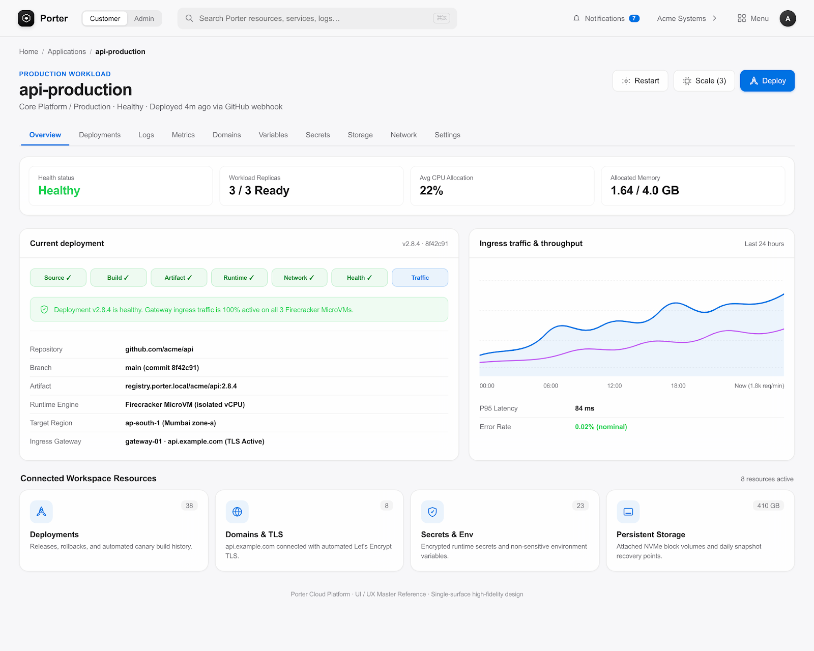
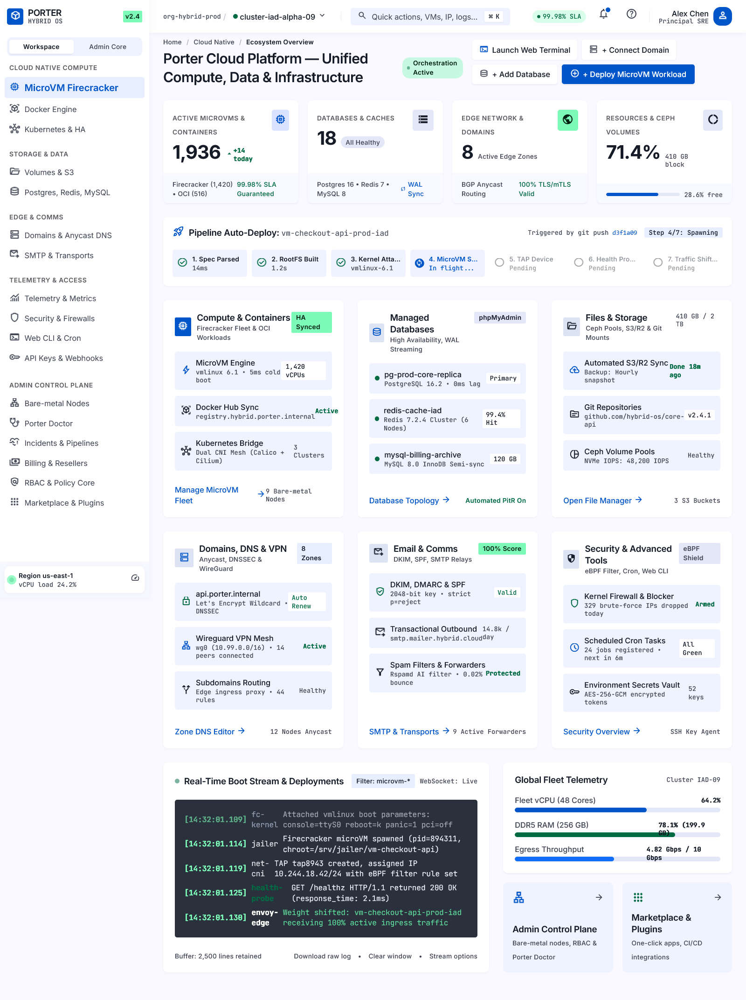
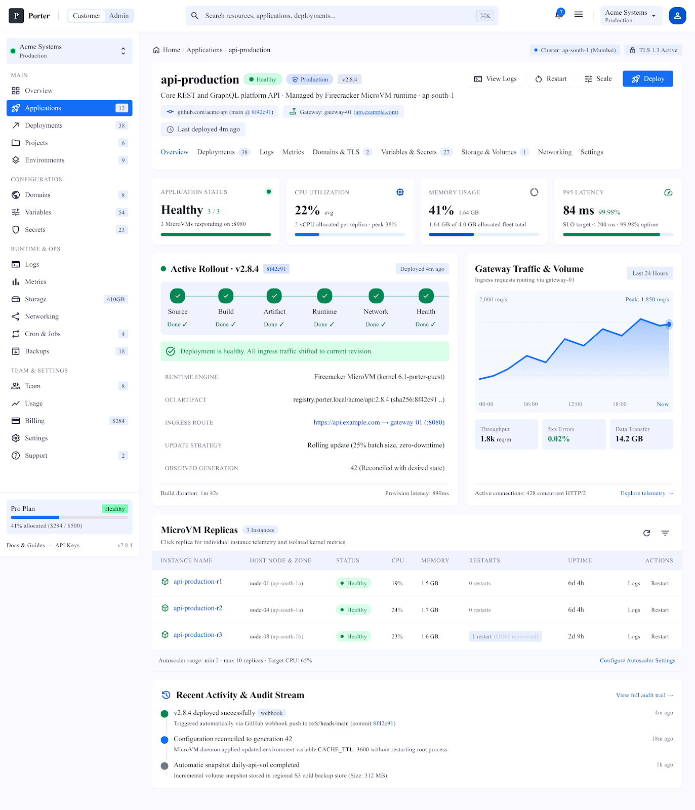
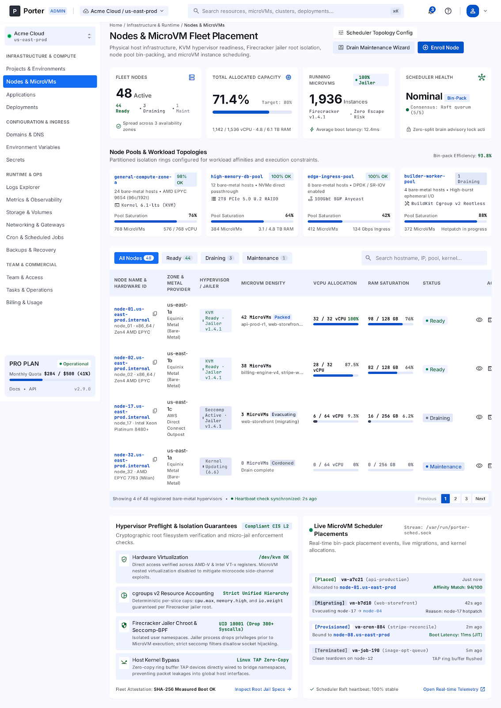

# Porter

**A self-hosted infrastructure control plane built around Firecracker MicroVMs.** Porter brings application deployment, infrastructure operations, and tenant administration behind one Go control plane and one API.

> **Status: development preview.** This repository is an evolving technical foundation, not a production-ready hosting platform. See [SRS.md](SRS.md) for the requirements and implementation-status snapshot. Features marked partial, planned, or deferred are not production-complete.

## What Porter is

Porter is designed to turn bare-metal servers, cloud VMs, and private infrastructure into a MicroVM-native application and hosting platform. Its intended scope includes:

- Git-based application builds and deployments;
- Firecracker MicroVM lifecycle management;
- node, project, team, and tenant administration;
- networking, gateway, domains, DNS, and TLS;
- persistent volumes, snapshots, and recovery;
- authentication, scoped RBAC, audit, and operational visibility;
- usage and commercial controls; and
- governed automation and AI-assisted operations.

Porter is **not** a Kubernetes distribution, Docker runtime, general-purpose hypervisor, or hyperscale-cloud replacement. OCI images are build inputs, not bootable VMs: workloads run in Firecracker after an explicit guest/root-filesystem preparation step. Kubernetes, Cloudflare, and object-storage providers are integrations or future capabilities, not hidden requirements for the core control plane.

## Architecture

```text
Browser / API client
        │
        ▼
Go control plane ───── Vue dashboard
        │
        ├── PostgreSQL (durable control-plane state)
        ├── API, authentication, RBAC, audit, controllers
        ├── Build pipeline (BuildKit / OCI inputs)
        └── Host agent ── Linux / KVM ── Firecracker MicroVMs
```

The architectural boundaries are intentional:

- **PostgreSQL** is the durable source of truth; Redis, when enabled, is optional acceleration.
- **Desired state** is reconciled toward observed state through repeatable controller operations.
- **BuildKit** performs builds; it does not run customer workloads.
- **Firecracker** is the intended workload isolation boundary. Docker is not in the customer runtime path.
- **Authorization and audit** belong at the control-plane/API boundary; privileged host operations stay behind the runtime/agent boundary.
- **Secrets** must not be committed or written to logs. Local runtime configuration and enrollment credentials belong outside Git.

## Implementation status

The status below summarizes the supplied SRS snapshot; it is not a guarantee that every path is production-hardened.

| Area | Snapshot status |
|---|---|
| Go control API, authentication, scoped RBAC, audit/task/event spine | Implemented; tenant/RLS enforcement still has gaps |
| Firecracker lifecycle and deployment rollout/rollback | Implemented in the codebase; production host hardening and full KVM end-to-end validation remain open |
| Build pipeline and OCI-to-rootfs preparation | Implemented in part; runner and registry coverage has gaps |
| Networking, multi-node placement, and preview lifecycle | Partial |
| Volumes and snapshots | Implemented; verified restore remains open |
| Secret injection and interactive console | Partial |
| Registry pull and native static-site builds | Missing in the SRS snapshot |
| Billing/commercial controls | Deferred by the current implementation plan |
| Production release | Not yet reached; see the acceptance gates in [SRS.md](SRS.md) |

Do not treat a UI screen, API route, roadmap item, or specification requirement as proof that a feature is complete. The SRS is explicit about this distinction.

## UI reference gallery

The repository includes **23 demo HTML prototypes** and their paired PNG screenshots in [`web/reference-ui/`](web/reference-ui/). These are design references with mock data—not live product screens, production metrics, or evidence that every depicted feature is implemented. See the [full reference gallery](web/reference-ui/index.html).

| Platform overview | Cloud-native platform |
|---|---|
|  |  |
| **Application deployment** | **MicroVM fleet placement** |
|  |  |

To browse the gallery and open individual HTML prototypes locally:

```sh
python3 -m http.server 8787 --directory web/reference-ui
```

Then open `http://localhost:8787` in a browser.

## Repository layout

```text
cmd/porter/       CLI entry point and mode dispatch
internal/          API, auth/RBAC, server, storage, runtime, builds, networking,
                   deployments, observability, and other control-plane packages
migrations/        PostgreSQL schema migrations
scripts/           development, smoke-test, and operator helpers
tests/             API acceptance, contract, and end-to-end tests
web/               Vue 3 dashboard and Vite build
web/reference-ui/  demo HTML prototypes, PNG screenshots, and a reference gallery
porter.toml.example
SRS.md              software requirements and implementation guidance
```

## Requirements

For control-plane and dashboard development:

- Go **1.26.6** toolchain (the `go.mod` toolchain directive);
- Node.js and npm for the Vue/Vite dashboard;
- PostgreSQL reachable at the URL in `porter.toml`;
- Docker is optional and can be used to run a local PostgreSQL instance.

Actually booting MicroVM workloads additionally requires a supported Linux host with KVM and Firecracker, plus the kernel and bootable root-filesystem artifacts configured for Porter. The local API/dashboard development flow does not itself boot guest VMs and does not require root.

## Local development

1. Clone the repository and create a local configuration file:

   ```sh
   git clone https://github.com/coffeeinit/porter.git
   cd porter
   cp porter.toml.example porter.toml
   ```

2. Edit the `[database].url` value in `porter.toml` for your PostgreSQL instance. For a disposable local database, you can run:

   ```sh
   docker run --name porter-dev-pg -d \
     -e POSTGRES_USER=porter \
     -e POSTGRES_PASSWORD=porter \
     -e POSTGRES_DB=porter \
     -p 127.0.0.1:5432:5432 \
     postgres:16-alpine
   ```

   The `porter:porter` database credentials above are only a local-development example. Do not reuse them for a deployed environment.

3. Set an initial admin password and a durable, random secret key. Keep the key stable across restarts and store it in a secret manager or another secure location; changing it can invalidate tokens and access to encrypted values.

   ```sh
   export PORTER_BOOTSTRAP_ADMIN_PASSWORD='choose-a-strong-local-password'
   export PORTER_SECRET_KEY="$(openssl rand -hex 32)"
   ```

   Save the generated `PORTER_SECRET_KEY` securely and reuse the same value for this installation. The bootstrap password is consumed when the initial admin is created; changing this variable later does not reset an existing admin password.

4. Start the API and dashboard together:

   ```sh
   bash scripts/dev-up.sh
   ```

   The API is available at `http://localhost:8080/api/v1`; the Vite dashboard is at `http://localhost:5173`. The development helper applies pending database migrations. It prints the seeded admin username (`admin`) on startup. Use the password you set above.

The development helper installs dashboard dependencies on first run. Press **Ctrl-C** to stop both processes.

## Build and test

```sh
# Go tests
go test ./...

# Build the dashboard assets
make frontend

# Build the Porter binary (build the dashboard first when embedding fresh assets)
make build

# Static analysis
go vet ./...
```

The built binary is written to `bin/porter`. The available modes and utilities are:

```text
porter server       Start the control plane (also the default when run without a mode)
porter agent        Run a host agent (requires enrollment/control credentials)
porter ptyd          Run the guest terminal daemon
porter migrate       Apply pending database migrations and seed the default organization
porter kernel set    Install a kernel artifact
porter image add     Register a bootable image
porter version       Print the version
porter help          Show command help
```

For VM boot, image preparation, and host-specific smoke tests, consult the scripts and the relevant SRS sections before running privileged operations.

## Configuration and security

- `porter.toml` is a local, ignored configuration file; start from `porter.toml.example`.
- Never commit `agent.env`, `.env` files, enrollment tokens, API keys, private keys, or deployment credentials. `agent.env.example` contains placeholders only.
- Set `PORTER_SECRET_KEY` and `PORTER_BOOTSTRAP_ADMIN_PASSWORD` through the process environment or a secret manager, not in source control.
- Keep development listeners and sample database credentials bound to trusted local interfaces only.

## Requirements and roadmap

See [SRS.md](SRS.md) for the normative product requirements, core invariants, honest implementation-status table, and release acceptance gates. The roadmap is staged: runtime and deployment foundations first, followed by gateway/DNS/TLS, multi-node operations, recovery, observability, commerce, and advanced orchestration. Production claims should wait until the SRS's release gates pass.

## License

No license file was included with the supplied backend archive. Until a license is added by the project owner, all rights remain reserved; do not assume permission to reuse or redistribute this code.
